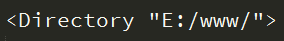
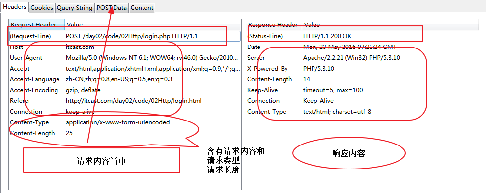

# http服务&ajax编程

## 1、服务器

> 前言：通俗的讲，能够提供某种服务的机器（计算机）称为服务器

#### 1.1、服务器类型

按照不同的划分标准，服务可划分为以下类型：

1. 按**服务类型**可分为：文件服务器、数据库服务器、邮件服务器、Web服务器等；
2. 按**操作系统**可分为：Linux服务器、Windows服务器等；
3. 按**应用软件**可分为 Apache服务器、Nginx 服务器、IIS服务器、Tomcat服务器、
   weblogic服务器、WebSphere服务器、boss服务器、 Node服务器等；

#### 1.2、服务器软件

使计算机具备提供某种服务能力的应用软件，称为服务器软件，
通过安装相应的服务软件，然后进行配置后就可以使计算具备了提供某种服务的能力。

常见的服务器软件有：

1. 文件服务器：Server-U、FileZilla、VsFTP等（FTP是File Transfer Protocol文件传输协议）；
2. 数据库服务器：oracle、mysql、SQL server、DB2、ACCESS等；
3. 邮件服务器：Postfix、Sendmail等；
4. **HTTP服务器**：Apache、Nginx、IIS、Tomcat、NodeJS等；


#### 1.3、HTTP服务器

即网站服务器，主要提供文档(文本、图片、视频、音频)浏览服务，一般安装Apache、Nginx服务器软件。
  
HTTP服务器可以结合某一编程语言处理业务逻辑，由此进行的开发，通常称之为**服务端开发**。 
 
常见的运行在服务端的编程语言包括 php、java、.net、Python、Ruby、Perl等。  


## 2、客户端

具有向服务器**索取服务**能力的终端，如比如 手机、电脑等，通过安装不同的客户端软件，
可以获取不同的服务，比如通过QQ获得即时通讯服务、通过迅雷获得下载服务等。

常见的客户端软件：浏览器、QQ、迅雷、Foxmail等。

以浏览器为宿主环境，结合 HTML、CSS、Javascript等技术，而进行的一系列开发，通常称之为**前端开发**。


## 3、网络基础

#### 3.1 IP地址

所谓IP地址就是给每个连接在互联网上的主机分配的一个32位地址。(就像每部手机能正常通话需要一个号码一样)

查看本机IP地址 ping、ipconfig、ifconfig（linux）


#### 3.2、域名

由于IP地址基于数字，不方便记忆，于是便用域名来代替IP地址，域名是一个IP地址的“面具”  

查看域名对应的IP地址 ping


#### 3.3、DNS服务

DNS（Domain Name System）因特网上作为域名和IP地址相互映射的一个分布式数据库，
能够使用户更方便的访问互联网，而不用去记住能够被机器直接读取的IP数串。

简单的说就是记录IP地址和域名之间对应关系的服务。

查找优先级 本机hosts文件、DNS服务器

ipconfig /flushdns 刷新DNS


#### 3.4、端口

端口号是计算机与外界通讯交流的出口，每个端口对应不同的服务。

*现实生活中，银行不同的窗口办理不同的业务。*

查看端口占用情况 netstat -an

常见端口号 80、8080、3306、21、22

## 4、软件架构

#### 4.1、C/S结构

即**C**lient、**S**erver

C/S工作流程图
 

 
在C/S结构的情况下，不同的服务需要安装不同的客户端软件，

比如QQ、迅雷、Foxmail这种情况下安装的软件会越来越多，同时也有许多弊端，

比如A出差，需要在B电脑上查收邮件，但是B电脑并未安装Foxmail等类似的客户端软件，

这样不得不先去下载Foxmail，非常不方便。


#### 4.2、B/S结构

B/S（即**B**roswer、**S**erver）解决了C/S所带来的不便，

将所有的服务都可以通过浏览器来完成（因为基本所有浏览器都安装了浏览器），

但B/S也有一些不利，比如操作稳定性、流畅度等方面相对较弱。

## 5、搭建HTTP服务

>Windows + Apache + Mysql + PHP，首字母组合。

#### 5.1 安装WampServer

安装wampserver，和普通软件安装无差别，除指定安装路径外，其它默认安装。

#### 5.2 管理HTTP服务

任务图标**绿色为正常启动**状态  
通过图形控制台可以启动、重启、停止所有服务  

 
或者单独启动、重启、停止特定服务  

 
**注意事项：**  
1、检查网络是不是通的 ping 对方IP  
2、检查防火墙是否开启，如果开启将不能正常被访问  
3、检查访问权限 **Allow from all**   
4、理解默认索引  
5、确保端口没有被**其它程序**占用  
6、“#”表示注释  
7、修改配置要格外小心，禁止**无意修改**其它内容  

#### 5.3 配置根目录

网站根目录是Web服务器上存放网站程序的空间，可通过修改配置文件自定义，如E:/www

**具体步骤如下：**   
1、打开配置文件，控制台选择  
  
或者 wampserver安装目录下bin\apache\Apache2.2.21\conf\httpd.conf
  
2、设定根目录，查找并修改  
     
例如：  
   
这样就指定了 "E:/www/"为存放网站的根目录。
  
3、配置根目录，查找  
     
修改成   
 

4、修改完后，并不能立即生效，需要  **重启Apache**  
   **注：可以指定任意目录为根目录**

#### 5.4 网站部署

将我们制作好的网页**拷贝**到配置好的根目录下，浏览器访问127.0.0.1即可。

#### 5.5配置虚拟主机

在一台Web服务器上，我们可以通过配置虚拟主机，然后分别设定根目录，实现对多个网站的管理。

具体步骤如下：  

1、开启虚拟主机辅配置，在httpd.conf 中找到  
  
  

去掉前面的#号注释，开启虚拟主机配置

2、配置虚拟主机，打开conf/extra/httpd-vhosts.conf   

  
  
分别修改以下三项  

DocumentRoot "E:/www/example"  
ServerName "example.com "  
ServerAlias "www.example.com"  

其它项无需指定。

3、修改DNS（hosts）文件
打开C:\Windows\System32\drivers\etc\hosts
目录是固定的
  
注：修改hosts文件权限

4、重启Apache

5、浏览器访问www.example.com

## 6、PHP基础

>文件以.php后缀结尾，所有程序包含在<?php ** 这里是代码 ** ?>  
>避免使用中文目录和中文文件名
>php页面无法直接打开需要运行在服务器环境当中

#### 6.1、最简单的php程序

```php
<?php
	// 用来指定编码集
	header('Content-Type:text/html; charset=utf-8');
	/*这是一个最简单的php程序*/
	echo 'hello world!';
?>
```


#### 6.3、变量

1、变量以$开头 字母/数字/下划线 不能以数字开头  
2、大小写敏感（区分大小写）

```php
    // 声明一个变量$a并赋值为10
    $a = 10;
 	// 输出一个变量$a
    echo $a;
    // 声明一个变量$b并赋值为10
    $b = 10;
    // 输出一个变量$b
    echo $b;
    
    // 输出顺序是自上向下的
    // 相当于 js dcoument.write()
```

#### 6.3、数据类型

**字符型**  
```php
    $str = 'hello world!';
```

**整型**  
```php
    $num = 10;
```

**浮点型**  
```php
    $float = 10.5;
```

**布尔型**  
```php
    $bool = true;
```

**数组**
```php
    // Javascript 数组定义方式 var arr = [1, 2, 3]
    // arr[0]、arr[1]、arr[1]
    
    // PHP 是这样定义数组的
    // 这种方式叫做**索引数组**
    $arr = array(1, 2, 3);	
    
    // echo $arr[0];
    // echo $arr[2];
    
    // 定义方式和Javascript有区别，但是访问方式是一样的
```

```php
    // var obj = {name: itcast, age: 10}
    
    // PHP另一种定定数组的方式，所表达的意义和Javascript一样，
    // 只是语法格式不一样
    // 这种方式叫做**关联数组**
    $arr1 = array('name'=>'itcast', 'age'=>10);

    // echo $arr1['name'];
    // echo $arr1['age'];
```

**对象**  
```php
    // Javascript var obj = {name: itcast, age: 10}
    // PHP需要先创建一个类，下面就是创建过程
    class Person {
        public $name = 'itcast';

        public $age = 10;
    }

    $person = new Person;

    // PHP访问一个对象属性的语法是不一样的
    echo $person->name;

    // obj['name']; obj.name 不行
```

**NULL**  
```php
    //PHP中一种特殊的数据类型，表示空值，即表示没有为该变量设置任何值null(空值)不区分大小写，null和NULL是一样的。
```


**单引号&双引号区别： ** 单引号内部的变量不会执行双引号会执行
```php
    $name = '小明';

    echo 'name is $name';//输出 name is $name
    echo '<br>';
    echo "name is $name";//输出 name is 小明
```
索引数组、关联数组（了解即可）

#### 6.4、运算符&内容输出

    基本与Javascript语法一致  
    . 号表示字符串拼接符，Javascript中为+号
    

echo：输出简单数据类型，如字符串、数值
```php
    /**
    * 连接符
    * Javascript中用+号表示连接符
    * PHP中使用.点号
    */
    
    $hello = 'hello';
    
    $world = 'world!';
    
    // PHP连接符用.号
    echo $hello . ' ' .$world;
```

print_r()：输出复杂数据类型，如数组
```php
    $arr = array('itcast', '今年', '10岁了');
    
    // 只能输出简单类型
    echo $arr;

    // 可以打印数组，但是输出的是一个数组的结构
    print_r($arr);
```

var_dump()：输出详细信息，如对象、数组（了解）
```php
    $arr = array('itcast', '今年', '10岁了');
    
    // 只能输出简单类型
    echo $arr;

    // 输出详细信息
    var_dump($arr);
    
    $hello = 'hello';
    // 输出详细信息
    var_dump($hello);
```


#### 6.5、函数

基本与Javascript基本一致  

函数名对大小写不敏感  
默认参数（了解即可）  

```php
    // 1、PHP中函数不可以省略参数
	// 2、PHP可以设置默认参数
	
	function sayHello($name='web developer') {
		echo $name . '你好!';
	}

	sayHello();
```

#### 6.6、分支，循环语句
```php
    /**
     * 分支控制语句、循环语句
     * 与Javascript一样
     * foreach 数组遍历函数，类似Javascript中的 for in
     */
     $name = 'itcast1';
 
     if($name == 'itcast') {
        echo '我已经在' . $name . '学习';
     } else {
        echo '我还没有学习过编程';
     }
```

```php
    /**
     * 分支控制语句、循环语句
     * 与Javascript一样
     * foreach 数组遍历函数，类似Javascript中的 for in
     */
    // 索引数组
    $arr = array('itcast', '今年', '10岁了');
     
    // PHP函数，计算数组的长度
    $length = count($arr);
 
    // echo $length;
 
    // 和Javascript是一样的
    // for($i=0; $i<$length; $i++) {
    // 	echo $arr[$i];
    // }
 
    foreach($arr as $k=>$v) {
        echo $k . '~~~' . $v;
    };
 
    // 关联数组
    $arr1 = array('name'=>'itcast', 'age'=>'10');
 
    // 验证关联数组不可以按索引下标来访问
    // echo $arr1[0];
 
     //PHP遍历一个关联数组
     foreach($arr1 as $key=>$val) {
        echo $key . '~~~' . $val;
     }
     
     // 实际开发都是用foreach来遍历数组的
```

#### 6.7、表单处理

表单name属性的是用来提供给服务端接收所传递数据而设置的 
   
表单action属性设置接收数据的处理程序

表单method属性设置发送数据的方式

当上传文件是需要设置 enctype="multipart/form-data"，且只能post方式

$_GET接收 get 传值

$_POST接收 post 传值

$_FILES接收文件上传  

    move_uploaded_file($_FILES['image']['tmp_name'], 'test.jpg');

```html
<form action="login.php" method="post">
    <div class="row">
        <label>用户：</label><input type="text" name="username"/>
    </div>
    <div class="row">
        <label>密码：</label><input type="password" name="password"/>
    </div>
    <div class="row">
        <input type="submit" value="登录"/>
    </div>
</form>
<form action="login.php" method="post" enctype="multipart/form-data">
    <div class="row">
        <label>图片：</label><input type="file" name="image"/>
    </div>
    <div class="row">
        <input type="submit" value="上传"/>
    </div>
</form>
```


    
#### 6.8、文件导入&&常用php函数

```PHP
    include '07.form.html';

    require '07.form.php'
```

```php
    $array = array(
        'username'=>'itcast',
        'password'=>'123456'
    );

    echo '获取数组的长度：'.count($array);
    echo '<br>';
    echo '判断是否在数组中：'.in_array('itcast',$array);
    echo '<br>';
    echo '检测数组中是否存在key：'.array_key_exists('username',$array);
    echo '<br>';
```


#### 6.9、应用实例

1、用户登录  

```html
    <form action="login.php" method="post">
        <div class="row">
            <label>用户：</label><input type="text" name="username"/>
        </div>
        <div class="row">
            <label>密码：</label><input type="password" name="password"/>
        </div>
        <div class="row">
            <input type="submit" value="登录"/>
        </div>
    </form>
```

```php
<?php
    header('Content-Type:text/html; charset=utf-8');

    /*数据库当中的数据*/
    $userInfo = array(
        'username'=>'itcast',
        'password'=>'123456'
    );

    /*拿到提交过来的数据*/
    $username = $_POST['username'];
    $password = $_POST['password'];

    /*去匹配数据库当中的数据*/
    if($userInfo['username'] == $username && $userInfo['password'] == $password){
        header('refresh:0;url=jdMsite/');
    }else{
        header('refresh:0;url=login.html');
    }
?>
```

2、动态网站   
   
**京东首页**
```php
    <?php
        header('Content-Type:text/html; charset=utf-8');
    
        $product_list = array(
            array(
            'imgUrl'=>'images/detail01.jpg',
            'newPrice'=>'15.00',
            'oldPrice'=>'19.00'
            ),
            array(
            'imgUrl'=>'images/detail02.jpg',
            'newPrice'=>'133.00',
            'oldPrice'=>'234.00'
            ),
            array(
            'imgUrl'=>'images/detail01.jpg',
            'newPrice'=>'340.00',
            'oldPrice'=>'1432.00'
            )
        );
    
        include 'index.html';
    ?>
```
```php
    <!--掌上秒杀的内容是会更新的而且是后台更新-->
    <ul class="sk_product">
        <?php foreach($product_list as $key => $val){ ?>
            <li>
                <a href="#">" alt=""/></a>
                <p class="new_price">&yen;<?php echo $val['newPrice'] ?></p>
                <p class="old_price">&yen;<?php echo $val['oldPrice'] ?></p>
            </li>
        <?php } ?>
    </ul>
```
**京东分类**

```php
<?php
    header('Content-Type:text/html; charset=utf-8');

    $category = array(
        '热门推荐',
        '潮流女装',
        '品牌男装',
        '内衣配饰',
        '家用电器',
        '电脑办公',
        '手机数码',
        '母婴频道',
        '图书',
        '家居家纺',
        '居家生活',
        '家具建材',
        '热门推荐',
        '潮流女装',
        '品牌男装',
        '内衣配饰',
        '家用电器',
        '电脑办公',
        '手机数码',
        '母婴频道',
        '居家生活',
        '手机数码',
        '母婴频道',
        '图书',
        '家居家纺',
        '居家生活',
        '潮流女装',
        '家具建材',
        '热门推荐',
        '潮流女装',
    );

    //echo count($category);

    include 'category.html';
?>
```
```php
    <!--左侧分类-->
    <div class="jd_cate_left">
        <ul>
            <?php foreach($category as $key=>$val){ ?>
                <li class="<?php echo $key==1?'now':'' ?>"><a href="javascript:;"><?php echo $val ?></a></li>
            <?php } ?>
        </ul>
    </div>
```


## 7、网络传输协议

#### 7.1、常见协议

1、HTTP、HTTPS 超文本传输协议 

2、FTP 文件传输协议

3、SMTP 简单邮件传输协议

    
#### 7.2、http协议

超文本传输协议（HTTP，HyperText Transfer Protocol) 网站是基于HTTP协议的，
例如网站的图片、CSS、JS等都是基于HTTP协议进行传输的。

HTML  Hypertext Markup Language

HTTP协议是由从客户机到服务器的请求(Request)和从服务器到客户机的响应(Response)进行了约束和规范。

即HTTP协议主要由请求和响应构成。


 
常用请求方法 **POST**、**GET**、PUT、DELETE

我们通过浏览器插件 FireFox httpFox  调试。ctrl shift f2 调用


##### 7.2.1、请求和请求报文

请求由客户端发起，其规范格式为：请求行、请求头、请求主体。

- **1、请求行**
 
由请求方式、请求URL和协议版本构成

    GET /day01/code/login.php?username=123&password=123 HTTP/1.1
    
    POST /day01/code/login.php HTTP/1.1

- **2、请求头**

Host：localhost请求的主机

Cache-Control：max-age=0控制缓存

Accept：*/* 接受的文档MIME类型

User-Agent：很重要

Referer：从哪个URL跳转过来的

Accept-Encoding：可接受的压缩格式

If-None-Match：记录服务器响应的ETag值，用于控制缓存

此值是由服务器自动生成的

If-Modified-Since：记录服务器响应的Last-Modified值

此值是由服务器自动生成的

- **3、请求主体**

即传递给服务端的数据

注：当以post形式提交表单的时候，请求头里会设置

Content-Type: application/x-www-form-urlencoded，以get形式当不需要


##### 7.2.2、 响应和响应报文

响应由服务器发出，其规范格式为：状态行、响应头、响应主体。

- **1、状态行**
 
由协议版本号、状态码和状态信息构成
    HTTP/1.1 200 OK

- **2、响应头**

Date：响应时间

Server：服务器信息

Last-Modified：资源最后修改时间 由服务器自动生成

ETag：资源修改后生成的唯一标识

由服务器自动生成

Content-Length：响应主体长度

Content-Type：响应资源的类型

- **3、响应主体**

即服务端返回给客户端的内容；

- 状态码
 
常见的有200代表成功、304文档未修改、403没有权限、404未找到、500服务器错误




## 8、AJAX编程

>即 Asynchronous [e'sɪŋkrənəs] Javascript And XML，
AJAX 不是一门的新的语言，而是对现有技术的综合利用。
>本质是在HTTP协议的基础上以异步的方式与服务器进行通信。
>

#### 8.1、 异步

指某段程序执行时不会阻塞其它程序执行，其表现形式为程序的执行顺序不依赖程序本身的书写顺序，相反则为同步。

**其优势在于不阻塞程序的执行，从而提升整体执行效率。**

XMLHttpRequest可以以异步方式的处理程序。

#### 8.2、 XMLHttpRequest

浏览器内建对象，用于在后台与服务器通信(交换数据) ，
由此我们便可实现对网页的部分更新，而不是刷新整个页面。

```javascript
    /*js 内置的 http 请求对象  XMLHttpRequest*/

    /*1.怎么使用 这个内置对象*/
    var xhr = new XMLHttpRequest;

    /*2.怎么样去组请求*/
    /*请求的行*/
    xhr.open('post','01.php');

    /*请求头*/
    //get  没有必要设置
    //post 必须设置 Content-Type: application/x-www-form-urlencoded
    xhr.setRequestHeader('Content-Type','application/x-www-form-urlencoded');

    /*请内容*/
    /*3.发送请求*/
    xhr.send("name=xjj&age=10");
```

##### 8.2.1、请求

HTTP请求3个组成部分与XMLHttpRequest方法的对应关系

1、请求行

    xhr.open('post','01.php');
    
2、请求头

    xhr.setRequestHeader('Content-Type','application/x-www-form-urlencoded');
    get请求可以不设置
    
3、请求主体

    xhr.send("name=xjj&age=10");
    get可以传空
    
**注意书写顺序**
    
    
##### 8.2.2、响应
HTTP响应是由服务端发出的，作为客户端更应关心的是响应的结果。

HTTP响应3个组成部分与XMLHttpRequest方法或属性的对应关系。

由于服务器做出响应需要时间（比如网速慢等原因），所以我们需要监听服务器响应的状态，然后才能进行处理。

```javascript
    if(xhr.readyState == 4 && xhr.status == 200){
        console.log('ok');
        console.log(xhr.responseText);
        /*把内容渲染在页面当中*/
        document.querySelector('#result').innerHTML = xhr.responseText;
    }
```
    **readyState**
    0：请求未初始化（还没有调用 open()）。  
    1：请求已经建立，但是还没有发送（还没有调用 send()）。  
    2：请求已发送，正在处理中（通常现在可以从响应中获取内容头）。  
    3：请求在处理中；通常响应中已有部分数据可用了，但是服务器还没有完成响应的生成。  
    4：响应已完成；您可以获取并使用服务器的响应了。

onreadystatechange是Javascript的事件的一种，其意义在于监听XMLHttpRequest的状态

1、获取状态行（包括状态码&状态信息）

    xhr.status 状态码
    
    xhr.statusText 状态码信息
    
 
2、获取响应头

    xhr.getResponseHeader('Content-Type');
    xhr.getAllResponseHeaders();
   
    
3、响应主体  
  
    xhr.responseText
    xhr.responseXML
    
我们需要检测并判断响应头的MIME类型后确定使用request.responseText或者request.responseXML
    
##### 8.3.3、API详解

    xhr.open() 发起请求，可以是get、post方式
    xhr.setRequestHeader() 设置请求头
    xhr.send() 发送请求主体get方式使用xhr.send(null)
    xhr.onreadystatechange = function () {} 监听响应状态
    xhr.status表示响应码，如200
    xhr.statusText表示响应信息，如OK
    xhr.getAllResponseHeaders() 获取全部响应头信息
    xhr.getResponseHeader('key') 获取指定头信息
    xhr.responseText、xhr.responseXML都表示响应主体
    
 注：GET和POST请求方式的差异（面试题）
 
 1、GET没有请求主体，使用xhr.send(null)
 
 2、GET可以通过在请求URL上添加请求参数
 
 3、POST可以通过xhr.send('name=itcast&age=10')
 
 4、POST需要设置
  
 5、GET效率更好（应用多）
 
 6、GET大小限制约4K，POST则没有限制
 
 问题？如何获取复杂数据呢？

#### 8.3、 XML

1、必须有一个根元素  
2、不可有空格、不可以数字或.开头、大小写敏感  
3、不可交叉嵌套  
4、属性双引号（浏览器自动修正成双引号了）  
5、特殊符号要使用实体  
6、注释和HTML一样  
虽然可以描述和传输复杂数据，但是其解析过于复杂并且体积较大，所以实现开发已经很少使用了。
   
```xml
<?xml version="1.0" encoding="UTF-8"?>
<root>
    <arrayList>
        <array>
            <src>images/banner.jpg</src>
            <newPirce>12.00</newPirce>
            <oldPrice>30.00</oldPrice>
        </array>
        <array>
            <src>images/banner.jpg</src>
            <newPirce>12.00</newPirce>
            <oldPrice>30.00</oldPrice>
        </array>
    </arrayList>
</root>
```
```php
<?php 
    header('Content-Type:text/xml;charset=utf-8');
    /*以xml格式传输数据的时候要求响应内容格式是   text/xml*/

    /*file_get_contents 获取文件内容*/
    $xml = file_get_contents('01.xml');

    /*输出xml内容*/
    echo $xml;
?>
```
```javascript
var xhr = new XMLHttpRequest;
xhr.open('get','01.php');
xhr.send(null);
xhr.onreadystatechange = function(){
    if(xhr.status == 200 && xhr.readyState == 4){
        /*获取到XML格式内容  放回的是DOM对象  document*/
        var xml = xhr.responseXML;
        /*通过选着器可以获取到xml的数据*/
        console.log(xml.querySelectorAll('array')[0].querySelector('src').innerHTML);
    }
}
```

#### 8.4、 JSON

即 JavaScript Object Notation，另一种轻量级的文本数据交换格式，独立于语言。

1、数据在名称/值对中  
2、数据由逗号分隔(最后一个健/值对不能带逗号)  
3、花括号保存对象方括号保存数组  
4、使用双引号  

```JSON
[
  {"src":"images/detail01.jpg","oldPrice":"10.12","newPrice":"130.00"},
  {"src":"images/detail02.jpg","oldPrice":"1.00","newPrice":"11.00"},
  {"src":"images/detail03.jpg","oldPrice":"100.00","newPrice":"1000.00"}
]
```

JSON数据在不同语言进行传输时，类型为字符串，不同的语言各自也都对应有解析方法，需要解析完成后才能读取

**1、PHP解析方法**  
json_encode()、json_decode()  
```PHP
<?php 
    header('Content-Type:text/html;charset=utf-8');
    /*以json格式传输数据的时候要求响应内容格式是   application/json*/
    /*注意也可以不设置  但是这遵循的一个规范*/

    /*file_get_contents 获取文件内容*/
    $json = file_get_contents('01.json');

    /*输出json内容*/
    echo $json;
    echo '<br><br>';

    $array = array(
        array('src'=>'images/detail01.jpg','newPrice'=>'12.00','oldPrice'=>'455.00'),
        array('src'=>'images/detail02.jpg','newPrice'=>'65.00','oldPrice'=>'878.00'),
        array( 'src'=>'images/detail01.jpg','newPrice'=>'100.00','oldPrice'=>'1000.00')
    );

    /*将php数组转化成json字符*/
    $json_array = json_encode($array);
    echo $json_array;
    echo '<br><br>';

    /*将json字符转化成php数组*/
    $array_json = json_decode($json_array);
    echo $array_json;
    echo '<br><br>';
?>
```  
**1、Javascript 解析方法**  
JSON对象  JSON.parse()、JSON.stringify()；  
JSON兼容处理json2.js  
总结：JSON体积小、解析方便且高效，在实际开发成为首选。
```javascript
    var xhr = new XMLHttpRequest;
    xhr.open('get','01.php');
    xhr.send(null);
    xhr.onreadystatechange = function(){
        if(xhr.status == 200 && xhr.readyState == 4){
            /*获取仅仅是字符串*/
            var text = xhr.responseText;
            
            /*需要把字符串转化成JSON对象*/
            var json_obj = JSON.parse(text);
            console.log(json_obj);
    
            /*我们也可以把JSON对象转化成字符串*/
            var json_str = JSON.stringify(json_obj);
            console.log(json_str);
        }
    }
```


#### 8.5、 兼容性

**关于IE的兼容方面，了解即可。**
```javascript
    function XHR() {
        var xhr;
        try {
            xhr = new XMLHttpRequest();
        }
        /*如果 try内的程序运行错误  抛出异常  捕捉异常  上面程序当中运行的错误*/
        catch(e) {
            /*在不同的IE版本下初始  ActiveXObject  需要传入的标识*/
            var IEXHRVers =["Msxml3.XMLHTTP","Msxml2.XMLHTTP","Microsoft.XMLHTTP"];

            for (var i=0;i<IEXHRVers.length;i++) {
                try {
                    xhr = new ActiveXObject(IEXHRVers[i]);
                }
                catch(e) {
                    /*如果出现错误的时候  停止当次的循环*/
                    continue;
                }
            }
        }
        return xhr;
    }
```

#### 8.6、 封装ajax工具函数

```javascript
/**
 * ITCAST WEB
 * Created by zhousg on 2016/5/24.
 */
/*
 * 1. 请求的类型                type    get post
 * 2. 请求地址                  url
 * 3. 是异步的还是同步的         async   false true
 * 4. 请求内容的格式            contentType
 * 5. 传输的数据                data    json对象
 *
 * 6.响应成功处理函数           success   function
 * 7.响应失败的处理函数         error     function
 *
 * 这些都是动态参数  参数对象  options
 * */

/*封装一个函数*/
window.$ = {};
/*申明一个ajax的方法*/
$.ajax = function(options){

    if(!options || typeof options != 'object'){
        return false;
    }

    /*请求的类型*/
    var type = options.type || 'get';/*默认get*/
    /*请求地址 */
    var url = options.url || location.pathname;/*当前的地址*/
    /*是异步的还是同步的 */
    var async = (options.async === false)?false:true;/*默认异步*/
    /*请求内容的格式 */
    var contentType = options.contentType || "text/html";

    /*传输的数据 */
    var data = options.data || {};/*｛name:'',age:''｝*/
    /*在提交的时候需要转成 name=xjj 这种格式*/

    var dataStr = ''/*数据字符串*/

    for(var key in data){
        dataStr += key+'='+data[key]+'&';
    }

    dataStr = dataStr && dataStr.slice(0,-1);

    /*ajax 编程*/
    var xhr = new XMLHttpRequest();

    /*请求行*/
    /*(type=='get'?url+'?'+dataStr:url)判断当前的请求类型*/
    xhr.open(type,(type=='get'?url+'?'+dataStr:url),async);

    /*请求头*/
    if(type == 'post'){
        xhr.setRequestHeader('Content-Type','application/x-www-form-urlencoded');
    }

    /*请求主体*/
    /*需要判断请求类型*/
    xhr.send(type=='get'?null:dataStr);

    /*监听响应状态的改变  响应状态*/
    xhr.onreadystatechange = function(){
        /*请求响应完成并且成功*/
        if(xhr.readyState == 4 && xhr.status == 200){
            /*success*/
            var data = '';
            var contentType = xhr.getResponseHeader('Content-Type');
            /*如果我们服务器返回的是xml*/
            if(contentType.indexOf('xml') > -1){
                data = xhr.responseXML;
            }
            /*如果我们的服务器返回的是json字符串*/
            else if(contentType.indexOf('json') > -1){
                /*转化json对象*/
                data = JSON.parse(xhr.responseText);
            }
            /*否则的话他就是字符串*/
            else{
                data = xhr.responseText;
            }

            /*回调 成功处理函数*/

            options.success && options.success(data);
        }
        /*计时请求xhr.status不成功  他也需要的响应完成才认作是一个错误的请求*/
        else if(xhr.readyState == 4){
            /*error*/
            options.error && options.error('you request fail !');

        }

    }
}
$.post = function(options){
    options.type = 'post';
    $.ajax(options);
}
$.get = function(options){
    options.type = 'get';
    $.ajax(options);
}


```

#### 8.7、 jquery的ajax

- jQuery为我们提供了更强大的Ajax封装
- $.ajax({}) 可配置方式发起Ajax请求
- $.get() 以GET方式发起Ajax请求
- $.post() 以POST方式发起Ajax请求
- $('form').serialize() 序列化表单（即格式化key=val&key=val）
- url 接口地址
- type 请求方式
- timeout 请求超时
- dataType 服务器返回格式
- data 发送请求数据
- beforeSend: function () {} 请求发起前调用
- success 成功响应后调用
- error 错误响应时调用
- complete 响应完成时调用（包括成功和失败）
- jQuery Ajax介绍
- http://www.w3school.com.cn/jquery/jquery_ref_ajax.asp


#### 8.8、 案例练习

1、Loading状态  
2、禁止重复提交  
3、表单处理  
4、数据验证  
接口化开发  
请求地址即所谓的接口，通常我们所说的接口化开发，其实是指一个接口对应一个功能，
并且严格约束了请求参数和响应结果的格式，这样前后端在开发过程中，可以减少不必要的讨论，
从而并行开发，可以极大的提升开发效率，另外一个好处，当网站进行改版后，服务端接口只需要进行微调。


**具体参考代码**

## 9、模版引擎

#### 9.2、 artTemplate 简介语法模板

```HTML
<script src="dist/template.js"></script>
```
下载(https://raw.github.com/aui/artTemplate/master/dist/template.js)

编写模版

    <script id="test" type="text/html">
    <h1>{{title}}</h1>
    <ul>
        {{each list as value i}}
            <li>索引 {{i + 1}} ：{{value}}</li>
        {{/each}}
    </ul>
    </script>
    
渲染数据
    
    var data = {
        title: '标签',
        list: ['文艺', '博客', '摄影', '电影', '民谣', '旅行', '吉他']
    };
    var html = template('test', data);
    document.getElementById('content').innerHTML = html;
    
简介语法    
    
    {{if admin}}
        {{include 'admin_content'}}
    
        {{each list}}
            <div>{{$index}}. {{$value.user}}</div>
        {{/each}}
    {{/if}}
    
    

#### 9.1、 artTemplate 原生 js 模板语法版

**使用**

在页面中引用模板引擎：

```HTML
<script src="dist/template-native.js"></script>
```
下载(https://raw.github.com/aui/artTemplate/master/dist/template-native.js)

**表达式**

    <% 与 %> 符号包裹起来的语句则为模板的逻辑表达式。

**输出表达式**

对内容编码输出：

    <%=content%>
    
不编码输出：

    <%=#content%>
    
编码可以防止数据中含有 HTML 字符串，避免引起 XSS 攻击。

**逻辑**

支持使用 js 原生语法

    <h1><%=title%></h1>
    <ul>
        <%for(i = 0; i < list.length; i ++) {%>
            <li>条目内容 <%=i + 1%> ：<%=list[i]%></li>
        <%}%>
    </ul>
模板不能访问全局对象，公用的方法请参见文档 辅助方法 章节
模板包含表达式

用于嵌入子模板。

    <% include('template_name') %>
    
子模板默认共享当前数据，亦可以指定数据：

    <% include('template_name', news_list) %>
    
辅助方法

使用template.helper(name, callback)注册公用辅助方法，例如一个基本的 UBB 替换方法：

    template.helper('$ubb2html', function (content) {
        // 处理字符串...
        return content;
    });
    
模板中使用的方式：

    <% $ubb2html(content) %>

## 10、同源&跨域

####10.1	同源

同源策略是浏览器的一种安全策略，所谓同源是指，域名，协议，端口完全相同。

####10.2	跨域

不同源则跨域
例如http://www.example.com/

    http://api.example.com/detail.html  不同源 域名不同  
    https//www.example.com/detail.html   不同源 协议不同  
    http://www.example.com:8080/detail.html	不同源	端口不同  
    http://api.example.com:8080/detail.html	不同源	域名、端口不同  
    https://api.example.com/detail.html	不同源	协议、域名不同  
    https://www.example.com:8080/detail.html	不同源	端口、协议不同  
    http://www.example.com/detail/index.html	同源	只是目录不同  

####10.3	跨域方案（课外拓展）

1、顶级域名相同的可以通过domain.name来解决，即同时设置 domain.name = 顶级域名（如example.com）  
2、document.domain + iframe  
3、window.name + iframe  
4、location.hash + iframe  
5、window.postMessage()  

参考资料
http://rickgray.me/2015/09/03/solutions-to-cross-domain-in-browser.html


#### 10.4、 jsonp

>JSON with Padding

**1、原理剖析**

其本质是利用了<script src=""></script>标签具有可跨域的特性，
由服务端返回一个预先定义好的Javascript函数的调用，并且将服务器数据以该函数参数的形式传递过来，
此方法需要前后端配合完成。

    <!--
    当我们用script标签去加载的时候  会把内容解析成js去执行
    -->
    <script>
        function fuc(data){
            console.log(data.name);
        }
    </script>
    <script src="http://www.guangzhou.com/api.php?callback=fuc"></script>
    


## 11、综合案例

#### 11.1、瀑布流案例（必须掌握）

#### 11.2、天气接口（必须掌握）
接口地址
http://developer.baidu.com/map/carapi-7.htm

    url: 'http://api.map.baidu.com/telematics/v3/weather?output=json&ak=0A5bc3c4fb543c8f9bc54b77bc155724',


#### 11.3、省级联动（课外拓展）