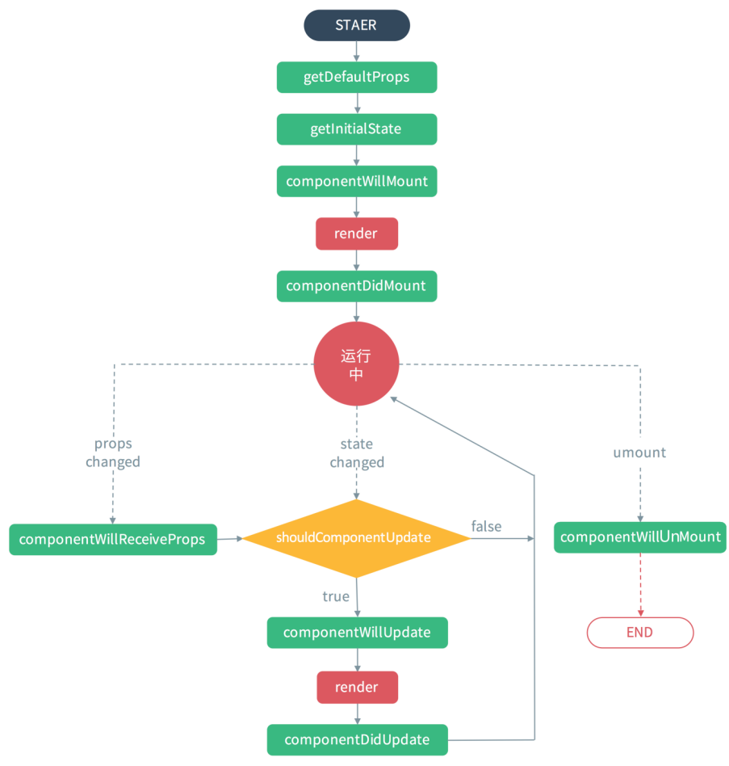

<title>react</title>

## react生命周期及基本用法，webpack配置

### webpack

```js
   // webpack.develop.config.js配置
    var path=require('path')
    var webpack=require('webpack')
    
    module.exports={
        entry:path.resolve(__dirname,'src/js/app.js'),
        output:{
            path:path.resolve(__dirname, 'dist'),
            filename:'bundle.js'
        },
        module:{
            rules:[
                //// es6转es5   jsx转成js
                {
                    test: /\.jsx?$/,
                    exclude: /node_modules/,
                    use: [
                        {
                            loader: "babel-loader",
                            options: {
                                // babel-preset-es2015
                                presets: ['es2015', 'react', 'stage-0', 'stage-1', 'stage-2']
                            }
                        }
                    ]
                },
                // 能够解析css的加载器
                {
                    test: /\.css$/,
                    use: ['style-loader', 'css-loader'],
                },
                // 解析sass文件的加载器
                {
                    test: /\.scss$/,
                    use: ['style-loader', 'css-loader', 'sass-loader'],
                },
                // 解析图片文件的url加载器 25000bit ~3kb
                {
                    test: /\.(png|jpg|jpeg|gif)$/,
                    use: 'url-loader?limit=25000&name=images/[name].[ext]'
                },
            ]
        },
        devtool: 'eval',
        devServer: {
            contentBase: __dirname + '/src',
            hot: true,  // �����ȸ���
            port:8080, // ָ���˿ں�
            host: 'localhost',
            open:true,    // openPage:''
        },
        plugins: [
            new webpack.HotModuleReplacementPlugin(),
        ]
    }

   //package.json配置
    "scripts": {
    "test": "echo \"Error: no test specified\" && exit 1",
    "dev": "webpack --config webpack.develop.config.js",
    "server": "webpack-dev-server  --config webpack.develop.config.js --content-base src",
    "publish": "webpack --config webpack.publish.config.js -p",
    "gulp": "gulp",
    "lint": "eslint --ext .js .vue src"
  },  
```
### react

- npm install react react-dom
- 下载依赖
   - npm install --global babel-cli   // 安装babel
   - npm install babel-preset-react  -dev-save// 安装babel转换jsx的包
   - npm install babel-preset-es2015 -dev-save// 安装babel转化ES6的包

- 基本配置

```js
  // index.html 入口文件
   <div id="app"></div>
   <script src="bundle.js"></script>
  //js>app.js  配置的js入口
   import React,{Component}from 'react'
   import ReactDOM from 'react-dom'

   import Hello from '../components/Hello'

    ReactDOM.render(
        <div>
            <Hello/>
        </div>,
        document.getElementById('app')
    )
    //components》.js 一个组件
    import React,{Component}from 'react'

    // import './hello.css'
    
    export default class Hello extends Component{
        render(){
            return (
                <div>
                    <h1>
                        你好世纪
                    </h1>
                </div>
            )
        }
    }
```

#### 组件的生命周期分成三个状态：
 - Mounting：已插入真实 DOM
 - Updating：正在被重新渲染
 - Unmounting：已移出真实 DOM

- 生命周期



#### 代码使用(在ES6中用ES5的写法会报错)

- ES5写法
```js
  var Hello = React.createClass({
    getInitialState() {
        return { liked: false };
    },
    render: function() {
        console.log(this.state.liked);
        return(
            <div>
                <h1 style={style}>Hello world</h1>
                <br/>
                <image/>
            </div>
        )
    }
  });
  module.exports=Hello;
```
- ES6写法
```js
  export default class Hello extends Component {
    constructor(props) {
        super(props);

        this.state = { count: 'es6'};
    }
    render() {
        return (
            <div>
                <h1 style={style}>Hello world{this.state.count}</h1>
                <br/>
                <image/>
            </div>
        )
    }
  }
```

- 属性扩散：标签上的自定义属性可以封装成一个对象在标签上使用： {...props}
- 小括号按照html解析，大括号按照js解析
- react-devtools 谷歌浏览器插件，使react的调试工具，可以监视react中的变量
- react在销毁之前调用的方法unmount，释放一些资源，释放一些权限，移除事件监听
- 和state属性进行绑定的标签为受控组件


## 
- react ant.design 蚂蚁金服的组件库
- golp
- 极客学院
 >  http://react-guide.github.io/react-router-cn/docs/guides/advanced/ComponentLifecycle.html


 - react native 江青青 李华明

