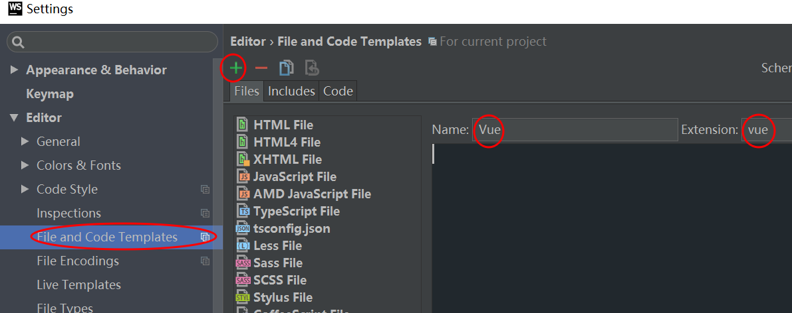
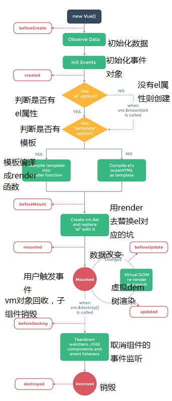
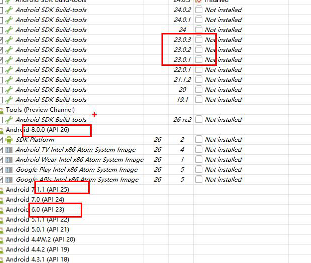
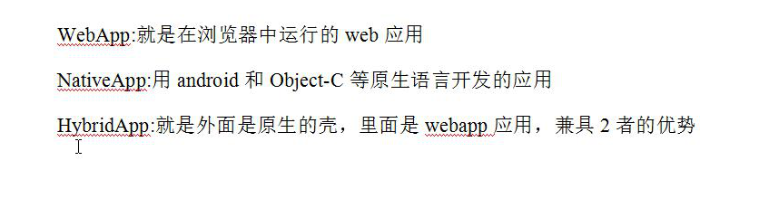
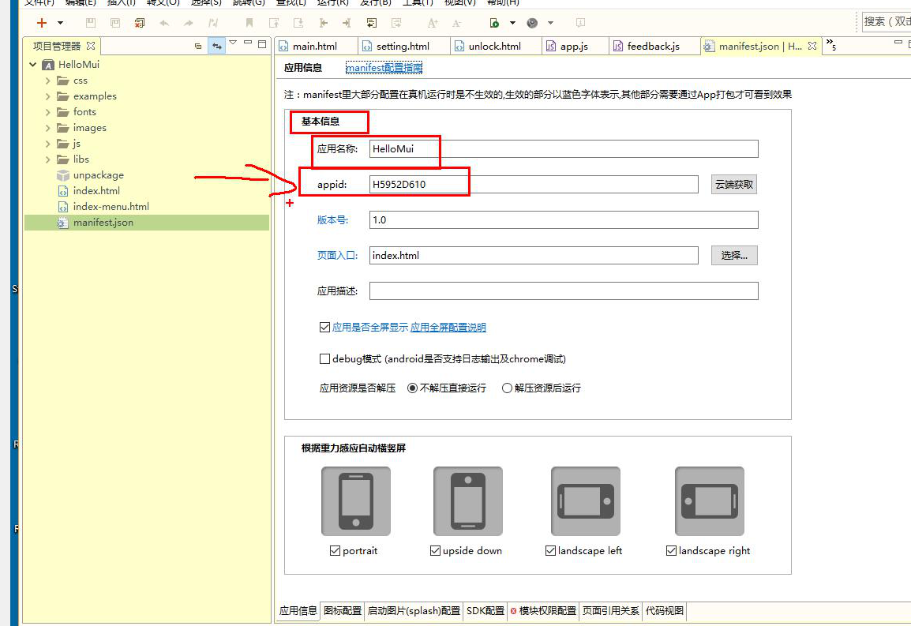

<title>vue</title>

## vue基本语法和webpack初级(8.4)

1. vue是一个渐进式框架，关注视图层
2. 组件 高度的封装
3. 虚拟DOM树，Virtual Dom就是在js中模拟DOM对象树来优化DOM操作的一种技术或思路

#### webstrom配置

1. 推荐使用webstrom2016
2. vue智能提示配置
   - File>Settings>Plugins=>vue.js(Browse repositories...)
   - File>Settings>Languages&Frameworks>ECMAScript 6
   - Editor>File and Code Templates（在File Types查看是否配置成功）>+
   

### vue基本语法

1. vue基本使用
```js
 
     <!--引入vue.js文件-->
    <script src=vue.min.js></script>
    <!--我们在html页面留了个坑-->
    <div id="app">
        {{ msg }}
    </div>
    <script>
//        创建vue的一个实例化对象
        var vm = new Vue({
            el:'#app',
            data:{
                msg:'欢迎来到vue课程'
            }
        })
    </script>
```
2. v-model和v-text，v-html
```js
        <!--v-model是双向绑定的-->
        <!--v-model是vue中唯一一个双向绑定的,其他的都不是-->
        <input v-model="title" type="text">

        <!--v-text一般用于除了input以外的其他标签-->
        <span v-text="msg"></span>
        
        <!--v-html一般用于解析html-->
        <div id="app">
        <span v-html="msg"></span>
        </div>
        <script>
            var vm = new Vue({
                el: '#app',
                data: {
                msg: '<h1>天气不错</h1>'
              }
            })
        </script>
```
3. v-bind对标签属性值进行绑定，两种写法
```js
   <div id="app">
        <a v-bind:title="tip"  v-bind:sdjfoisodifwfe="tip">这是个a标签</a>

        <!--v-bind的简写形式-->
        <a :title="tip">这是个a标签</a>
    </div>
    <script>
        var vm = new Vue({
            el:'#app',
            data:{
                title:'可以出去玩',
                tip:'这是个title'
            }
        })
    </script>
```
4. v-on绑定事件，两种写法
```js
     <div id="app">
        <!--v-on一般是进行事件处理的-->
        <button v-on:click="btnClicked">按钮</button>

        <!--v-on有一个简写形式-->
        <button @click="btnClicked"></button>
    </div>
    <script>
//        这样写可以接收到事件,但是不推荐这样写
//        function btnClicked() {
//            alert(1)
//        }
        var vm = new Vue({
            el:'#app',
            data:{
                title:'我很高兴来到这里'
            },
            methods:{
                btnClicked(){
                    alert(2)
                }
            }
        })
    </script>
```
5. v-if隐藏后连代码都没有了，只留下一个注释占位符;v-show 隐藏后代码还在，只是设置display:none
```js
    <div id="app">
        <span v-if="isTrue" v-text="msg"></span>
         <!-- <span v-show="isTrue" v-text="msg"></span> -->
        <button v-on:click="click">按钮</button>
    </div>
<script>
    var vm = new Vue({
        el:'#app',
        data:{
            msg:'天气不错',
            isTrue:true
        },
        methods:{
            click(){
                this.isTrue = !this.isTrue
            }
        }
    })
</script>
```
6. v-for三种用法
```js
    <div id="app">
        <!--v-for的第一种用法-->
        <ul>
            <li v-for="item in names">
                {{item}}
            </li>
        </ul>
        <!--v-for的第二种用法-->
        <ul>
            <li v-for="(item,index) in names">
                {{item}}------{{index}}
            </li>
        </ul>
        <!--v-for的第三种用法-->
        <ul>
            <li v-for="(value,key,index) in user">
               {{value}}---{{key}}-=---{{index}}
            </li>
        </ul>
    </div>
    <script>
        var vm = new Vue({
            el:'#app',
            data:{
                names:['狼厂','鹅厂','鸟厂','马厂','数字工厂'],
                user:{name:'老梅',age:'17.5'}
            }
        })
    </script>
```
7. 私有组件和全局组件
  - 写在Vue对象中为components私有组件时，组件名称不能大写，名称中可以有-。
  - 组件标签在使用时内部不能带有内容，内容会被定义组件时模块中的内容替换。
  - 注意：template属性必须给根元素,创建全局组件必须在Vue对象实例化前进行
```js
   //私有组件
   <div id="app">
        <privatecomponent></privatecomponent>
    </div>
    <script>
        var vm = new Vue({
            el:'#app',
            components:{
                'privatecomponent':{
                    template:'<h1>这是第一个私有组件</h1>'
                }
            }
        })
    </script>

     //全局组件的定义
     <div id="app">
        <my-component/>
    </div>
    <div id="app1">
        <my-component></my-component>
    </div>
    <script>
        Vue.component('my-component',{
            template:'<my-haha</my-haha>'
        })

        Vue.component('my-haha',{
            template:'<h1>my-haha的使用</h1>'
        })
        var vm = new Vue({
            el:'#app',
        })
        var vm1 = new Vue({
            el:'#app1'
        })
    </script>
```
8. 私有过滤器和全局过滤器
  - 管道前面的输出等于后面的输入，管道符前面的变量输出成为管道符后面函数的输入
```js
//私有过滤器
    <div id="app">
        {{ msg | toLower }}
    </div>
    <script>
        var vm = new Vue({
            el:'#app',
            data:{
                msg:'MSDJFSOIFDWOEIF'
            },
            filters:{
                // 实现一个小写转化的过滤器
                toLower(input){
                    return input.toLowerCase()
                }
            }
        })
    </script>

    //全局过滤器
     <div id="app">
        {{title | toUpper}}
    </div>
    <script>
        Vue.filter('toUpper',function (input) {
            return input.toUpperCase()
        })

        var vm = new Vue({
            el:'#app',
            data:{
                title:'sdojfiodifosdfs'
            }
        })
    </script>
```

#### router模块和传值：vue-router.min.js

```js

 <script src="vue.min.js"></script>
 <script src="vue-router.min.js"></script>
 <div id="app">
    <!--路由传值的方式-->
    <a href="#/share/2">go</a>
    <!--router-link是对a标签的封装，推荐使用-->
   <router-link to="/share/1">go</router-link>
    <!--router-view路由内容专用填坑-->
    <router-view></router-view>

 </div>
 <script>

    //全局组件
  var share= Vue.component('share',{
      data(){   //添加全局临时变量
        return {
            number:''
        }
      },
      //这个方法是在当前组件全部加载完成以后调用的方法
      created(){      //调用外面传递的值
          this.number=this.$route.params.id
        },
      props:['id'],  //接收外面传递的值
      template:'<h1>我的天啊{{number}}</h1>' //template必须给根元素
  });
  var rt=new VueRouter({
      routes:[         //存放路由信息的数组
          {name:'share',path:'/share/:id',component:share}
      ]
  });
  var vm =new Vue({
        el:'#app',
        router:rt,   //关联路由
        data:{
            title:'静态网站'
        }
    })
 </script>

```
#### $http异步模块：vue-resource.min.js

```js
 //get
 <script src=vue.min.js></script>
 <script src=vue-resource.min.js></script>
 <body>
    <div id="app">
        {{title}}
        <br>
        <button v-on:click="btnBeClicked">发送get请求</button>
        <br>
        {{message}}
    </div>
    <script>
        var vm = new Vue({
            el:'#app',
            data:{
                title:'get方法的介绍',
                message:[]
            },
            methods:{
                btnBeClicked(){
                    // 发送请求
                    var url = 'http://182.254.146.100:8899/api/getlunbo'
                    this.$http.get(url).then(
                            function (data) {
                                this.message = data.body.message
                            },
                            function (err) {

                            }
                    )
                }
            }
        })
    </script>

    // post 
          
        var url = 'http://182.254.146.100:8899/api/getlunbo'
        this.$http.post(url,{content:'xxxxxxxx'},{emulateJSON:true}).then(
                function (response) {

                    },
                    function (err) {
                            console.log(err)
                        }
                    )
    // JSONP
         this.$http.jsonp(url).then(
                        function (response) {

                        },
                        function (err) {
                            console.log(err)
                        }
                )                

```

### webpack

1. 插件  Plugins
2. 出口和入口的设置
3. 加载器 Loaders
4. 安装(先npm init初始化环境)
   - 第一步 npm i webpack -g （只要安装一次）
   + 第二步 npm install webpack --save-dev （创建一个新项目就安装一次）
      - -dev 开发依赖，打包就不会带这个包
   + 第三步
      - 在实际开发环境中，存在多个配置，发布和开发以及其它运行不同的配置
      - webpack.develop.config.js //开发时候的配置
      - webpack.publish.config.js //发布时候的配置
      - webpack --config webpack.develop.config.js //运行打包 
      - webpack.config.js 只有一个配置 cmd中执行webpack就可以了  
   + 第四部
     - 加载器：去git上查找下载安装babel-loader的方法
     - 看README.md或者git中查看配置方法。
   + 第五步配置config(webpack.develop.config.js)

```js

 // webpack开发时候的配置文件
  const path=require('path')

  module.exports={
    //webpack中的三大亮点之一：入口出口设置
    entry:path.resolve(__dirname,'./src/app.js'),//入口
    //出口设置，把项目打包的位置
    output:{
        path:path.resolve(__dirname,'dist'), //导出到指定的文件夹
        filename:'tt.js'         //导出的文件名
    },
     //webpack中的第二个亮点：加载器loader
     module:{
        rules:[
             // babel-loader的加载器信息
            {
                test: /\.js$/,
                exclude: /(node_modules|bower_components)/,
                use: {
                    loader: 'babel-loader',
                    options: {
                        presets: ['env']
                    }
                }
            }
        ]
    }
  }

```   
     
#### 知识点
1. vetur给vscode使用的vue语法提示高亮的插件
2. Moment.js 日期过滤器
3. npm run 名称 --可以直接使用package.json中scripts配置的快捷命令
4. nrm test 测试镜像反应速度
5. 安装webpack的文件夹名字不能叫webpack，程序会认为在webpack中安装webpack会报错


## 加载器和插件(8.5)

### vue基本的三个组成部分：组件模板，项目入口，承载单页面
1. 引入vue模块前要先下载
  - npm i vue --save

```js
    // 一个拥有独立html，css，js的组件模板app.vue
    <template>
     <section>
       <h1>苍茫的天涯是你的哎</h1>
       
     </section>
    </template>
    <script></script>
    <style>
      h1{
          background-color: hotpink;
       }
    </style>
```
```js
    //项目入口main.js文件
    import Vue from 'vue'         //导入vue.js
    import app from './app.vue'  //导入vue模板
    const vm=new Vue({
    el:'#app',
    //必须使用箭头函数
    render:create=>create(app)     //渲染到index.html留的坑里
  });
  
```

```html
<!--进行展示的index.html页面-->
<div id="app">
    <app></app>
</div>
<script src="./tt.js"></script>

```

### 加载器（本质上就是通过一些优化把开发代码转化为发布的代码）

1. vue-loader  1.0配置中可以不写-loader，2.0必须写
2. 加载器在使用前要先进行下载
3. 三种加载器：ES6加载器，css加载器，图片加载器
4. 先执行加载器，然后导入src中的文件，生成后在导出
5. 加载器的两种配置方式，参考图片加载器

```js
   const path=require('path');
   const webpack=require('webpack');
   module.exports={
       //webpack中的三大亮点之一：入口出口设置
       entry:path.resolve(__dirname,'./src/main.js'),
       //出口设置，把项目打包的位置
       output:{
           path:path.resolve(__dirname,'dist'), //导出到指定的文件夹
           filename:'tt.js'         //导出的文件名
       },
       //webpack中的第二个亮点：加载器loader
       // 加载器解析.vue等格式的文件
       module:{
          rules:[
                 {  //把ES6解析到ES5的加载器 jsx（使代码混编，一个文件中写css，html，js）转化js，
                     test: /\.js$/,
                     exclude: /(node_modules|bower_components)/,
                     use: {
                         loader: 'babel-loader',
                         options: {
                             presets: ['env']
                         }
                     }
                 }, {  //解析vue的加载器
                     test: /\.vue$/,
                     use: {
                         loader: 'vue-loader'
                     }
                 }, {  //解析css的加载器
                     test: /\.css$/,
                     use: [ 'style-loader', 'css-loader' ]
                 }//解析图片加载器 url-loader
                 ,
                 // {
                 //     test: /\.(png|jpg|gif)$/,
                 //     use: [
                 //         {
                 //             loader: 'url-loader',
                 //             options: {
                 //                 limit: 8192
                 //             }
                 //         }
                 //     ]
                 // }
                 {
                     test: /\.(png|jpg|gif)$/,
                     use:'url-loader?limit=25000&name=images/[name].[ext]' 
                     //1byte=8bit(位) bit 小于这个限制则     
                     //把图片转为base64字符串，这个时候可以base64字符串通过css设置背景图片减少图片http请求
                 }

        ]
    }
   
}
```

### 插件(webpack第三个亮点：插件的使用)

插件分为两种：webpack自带的不需要安装，第三方的需要安装

#### webpack-dev-server（修改项目，打包文件自动更新服务）配置三部曲

本质上通过webpack内置的热更新插件实现

```js
        //1.下载 npm install webpack-dev-server --save-dev
      
       //2.webpack.develop.config.js 配置
       const webpack=require('webpack');
       module.exports={
               //...省略若干配置
              devtool: 'eval',
              devServer: {
                 contentBase: path.resolve(__dirname, './src'), // 当前服务器监听的路径
                 hot: true,  // 热更新
                 port:8080,  // 定义端口号
                 host: 'localhost',
                 open:true    // 是否自动打开浏览器
                 openPage:""   //配置open:true时，必须给一个openPage:""默认配置
              },
             plugins: [
             //  html-webpack-plugin
              new webpack.HotModuleReplacementPlugin(), //热更新插件
             ]
      
        }
        // 3.package.json配置  
        //"server":"webpack-dev-server --config webpack.develop.config.js --content-base src"
      
        //npm run server
```

#### 压缩插件（一般不用，效果不好），分离第三方包的插件，自动生成html的插件

1. 压缩文件一般使用在命令中加-p,压缩比内置压缩插件效果更好（更小）
   - "pb": "webpack --config webpack.publish.config.js -p",
2. 自动生成html的插件是第三方插件
   - html-webpack-plugin

```js
 const HtmlWebpackPlugin = require('html-webpack-plugin');
 plugins:[
        // 压缩插件(一般不用)
        // new webpack.optimize.UglifyJsPlugin({
        //     beautify: false,
        //     mangle: {
        //         screw_ie8: true,
        //         keep_fnames: true
        //     },
        //     compress: {
        //         warnings: false,
        //         screw_ie8: true
        //     },
        //     comments: false
        // }),

        // 分离第三方的插件，不是我们自己写的模块
        // 抽取第三方的插件（如vue.js）                             所有第三方文件打包的文件
        new webpack.optimize.CommonsChunkPlugin({name:'vendors',filename:'vendors.js'}),

        // 自动生成html的插件
        // new HtmlWebpackPlugin({
        //     title: 'My App',
        //     filename: 'index.html',
        //     template: 'src/index.html',
        //
        // })
        new HtmlWebpackPlugin({
            template: './src/index.html',
            htmlWebpackPlugin: {
                "files": {
                    "js": ["bundle.js","vendors.js"] //设置引用的文件，自动生成标签插入html中
                }
            },
            // 进行压缩,情怀至上
            minify: {
                removeComments: true,
                collapseWhitespace: true,
                removeAttributeQuotes: true
            }
        }),
    ]
```


### ESLint配置（编码规范）

1. npm install  eslint -g （可能需要配置本地 npm install  eslint --save-dev）
2. npm install babel-eslint -g（可能需要配置本地 npm install babel-eslint --save-dev）
3. package.json的scripts中配置快捷命令 
  - "lint": "eslint --ext .js .vue src"
4. 添加自定义代码规范，在全局根目录下添加文件.eslintrc.js
  - 运行后eslint --init，根目录中将有一个.eslintrc文件
5. 在webpack.develop.config.js开发配置文件中配置  

```js
  //.eslintrc.js
  // eslint的语法规则

    module.exports = {
        // 开启推荐配置信息
        // "extends": "eslint:recommended",
        // 默认情况下，ESLint 会在所有父级目录里寻找配置文件，一直到根目录。如果你想要你所有项目都遵循一个特定的约定时，这将会很有用，但有时候会导致意想不到的结果。为了将 ESLint 限制到一个特定的项目，在你项目根目录下的  package.json 文件或者 .eslintrc.* 文件里的 eslintConfig 字段下设置 "root": true。ESLint 一旦发现配置文件中有 "root": true，它就会停止在父级目录中寻找。
        "root": true,
        // 脚本在执行期间访问的额外的全局变量
        // 当访问未定义的变量时，no-undef 规则将发出警告。如果你想在一个文件里使用全局变量，推荐你定义这些全局变量，这样 ESLint 就不会发出警告了。你可以使用注释或在配置文件中定义全局变量。
        "globals" : {
            "window":true,
            "document":true,
            "$":true
        },
        // 设置插件
        // "plugins": [
        //     'html'
        // ],
        // 设置解析器选项（必须设置这个属性）
        "parserOptions": {
            "ecmaVersion": 7,
            "sourceType": "module",
            "ecmaFeatures": {
                "jsx": true,
                // "arrowFunctions": true,
                // "experimentalObjectRestSpread": true,
                // "classes": true,
                // "modules": true,
                // "defaultParams": true
            }
        },
        // 启用的规则及各自的错误级别
        "rules" : {
            // 禁止用console
            "no-console":2,
            // 禁止用分号
            "semi":[1,'never'],
            // 在同一个作用域中禁止多次重复定义
            //"no-redeclare":1
        },
        // 指定你想启用的环境
        "env": {
            "browser": true,
            "node": true
        },
        "parser": "babel-eslint"
    };
```
```js
 //配置文件（config）配置信息
  module.exports={
    //。。。。其它各种配置
    module:{
        rules:[
            // eslint-loader的配置信息
            // exlint-loader的加载器配置信息
            // 配置编码规范的时候需要ES6解析到ES5的加载器配置到其中
            {
                test: /\.js$/,
                exclude: /node_modules/,
                use: [
                    'babel-loader',
                    'eslint-loader'
                ],
                //webpack配置改了，要修改配置方法
                // query: {
                   // cacheDirectory: true
               // } 
            },
            { //只是检查的时候用，调试时候注释
                test: /\.vue$/,
                enforce: 'pre',  
                include: /src/, 
                use: [{
                    loader: 'eslint-loader',
                    options: {
                        formatter: require('eslint-friendly-formatter')   // 
                    }
                }]
            },
            // {  //把ES6解析到ES5的加载器
            //     test: /\.js$/,
            //     exclude: /(node_modules|bower_components)/,
            //     use: {
            //         loader: 'babel-loader',
            //         options: {
            //             presets: ['env']
            //         }
            //     }
            // },


              
              //其它配置，各种加载器

        ]
    },
  }
```

- MUI-最接近原生APP体验的高性能前端框架

## mui和mint-ui（8.7）

- mui和mint-ui先git把两个项目从githab上克隆下来（根据线上的demo到两个克隆的包里找代码）
- 然后npm把两个包下载到项目中。

#### vue模板

```js
    <template>
    
    </template>
    <!--scoped：保证样式只在组件内部使用-->
    <style scoped>
    
    </style>
    <!--让编辑器识别ES6，不报错-->
    <script type="text/ecmascript-6">
       
    </script>
```
```js
  //一个页面级组件script标签中内容
  import banner from './Tools/banner.vue'
  import url from './Tools/Url.js'

    export default{
       data(){
           return {
               banners:[]
           }
       },
        created(){
            this.getBanner()
        },
        methods:{

           getBanner(){
               this.$http.get(`${url.HTTP}${url.SERVER_PATH}:${url.PORT}/api/getlunbo`).then(rel=>{
                  console.log(rel)
                   this.banners=rel.body.message
               },rej=>{})
           }
        },
        components: {
            banner
        }


    }
```
```js
       //url-loader配置图片和字体解析
       { test: /\.(gif|jpg|png|woff|svg|eot|ttf)$/,
        use: 'url-loader?limit=50000&name=[path][name].[ext]'}
```
```js
  //webpack入口js引入模块方式
  import  vueResource from 'vue-resource'
  Vue.use(vueResource)
```

- linkActiveClass:'mui-active'路由模块的该属性可以配置选中a标签的类名。
- 打包代码执行顺序：先执行加载器，把内容导入到webpack,执行插件然后导出
- mui代理官网
  > http://www.dcloud.io/mui.html 
- badge 徽标，类似于购物车上的红色小圆（显示数字）
- 图片设置环绕，图片过大（不用缩小图片）：background-repeat: round;
- Mockplus原型设计工具


## 组件传值，路由传值(8.8)

- 组件传值，路由传值
```js
    //组件调用传值
   <banner :bannerdt="banners"></banner>

   //组件内部获取值
   <script type="text/ecmascript-6">
       export default{
           //如果是路由传值要使用这种方式获取值使用,如果是组件传值，直接在模板里使用
            methods:{
                 get(){
                     this.$route.params.id
                 }
            }
            //组件传值，路由传值都要通过这种方式接收
           props:['bannerdt']
       }
  </script>
```
- 动态生成router-link标签的两种方法
```html
   <router-link :to="{name:'newsinfo',params:{id:item.id}}">
    <router-link v-bind='{to:"/newsDetail/"+item.id}'>
```
- 好用的日期过滤器：momentjs
- IM即时通讯(网易云)
- face++人脸识别服务
- ping++可以简便使用多种支付方式的开发者平台
- white-space: nowrap;文字不换行


## 图片详情页，商品列表页（8.10）

- ref:获取修改表单原生的值
```js
 <textarea placeholder="请输入评论内容"></textarea>
 //this.$refs.textArea1.value 
```
- 假请求：当配合安卓或ios开发的时候，需要调用底层（如拍照），这个时候可以发送一个请求，让安卓的同事去实现功能。

- vue-picture-preview 图片预览组件，组件标签要放在图片的上方。

```js
 export default{
        data(){
            return{
                isBack:true
            }
        },

        methods:{
            back(){
                 //路由对象，回撤
                this.$router.go(-1);
            }
        },
        //监控一个对象
        watch:{
            //url对象
            '$route':function (newValue,oldValue) {
                if(this.$route.path==="/home"){
                    this.isBack=false;
                }else {
                    this.isBack=true;
                }
            }
        }，
        //注册页面所要用到的组件
         components:{
            banner
        },
    }
```
+ style的scoped独立样式作用域
 - 添加scoped之后，实际上vue在背后做的工作是将当前组件的节点添加一个像data-v-1233这样唯一属性的标识。
 - 当然也会给当前style的所有样式添加[data-v-1233]这样的话，就可以使得当前样式只作用于当前组件的节点。
 - 所以如果在父组件中修改子组件的样式不能加scoped属性。


## 动画实现，组件向父组件传值（8.11）

### 传值的两种方式

- 父子组件之间的传值
```js
     //子组件
    export default{
        data(){
            return {
                number:1
            }
        },
        methods:{
            add(){
                this.number++
                document.querySelector("#numb").innerText=this.number
                this.submitCount()
            },
            jian(){
                if(this.number>1){
                    this.number--
                    document.querySelector("#numb").innerText=this.number
                    this.submitCount()
                }
            },
            submitCount(){
                this.$emit('count',this.number)//count：父组件接收值的标记
            }
        }
    }

    //父组件

    //父组件调用是监控count标记把值传入getCount方法中。
    <number v-on:count="getCount"></number>

    methods:{
        //通过方法的形式获取子组件传递的值
        getCount(num){
                this.count=num
            }
    }
```

- 没有直接关联的组件传值

```js
   //在一个js文件中定义一个独立的vue对象保存值（中转站）
   import Vue from 'vue'
   export var mddata=new Vue()  //导出一个vue

   //传值的组件
   //使用这个值的地方进行引用
   import {mddata} from './Tools/middledata'
   //传递值组件调用的方法
    mddata.$emit('shopcar',this.count)

   //获取值的组件，值传递的约定标识shopcar
   import {mddata}from './components/Tools/middledata'
   mddata.$on('shopcar',function (number) {
      
    })
```

### 动画实现

- 贝塞尔曲线：可以设置动画运动轨迹速度的快慢
- js钩子hook》中间件，动画经过的事件就是一系列的中间件
```js
   //对要进行运动的元素设置css
   transition: all 1s cubic-bezier(.56,-0.42,.36,.59);

  //设置元素在运动时经过的方法
                <transition
                        v-on:before-enter="beforeEnter"
                        v-on:enter="enter"
                        v-on:after-enter="afterEnter"
                >
                <div v-show="isshow" class="bill"></div>
                 </transition>

    //  在methods中设置动画要调用的方法      
           // 进入之前调用的一个方法
            beforeEnter: function (el) {
                el.style.transform = "translate3d(0,0,0)"
            },
            // 进入时候调用的方法
            enter: function (el, done) {
                var offset = el.offsetWidth  //设置这个使元素感觉到属性在发生变化
                el.style.transform = "translate3d(60px,303px,0)"
                done()
            },
            // 进入完成以后调用的方法
            afterEnter: function (el) {
                this.isshow = !this.isshow
            },      
```


## vue生命周期，indexdb数据库，两种手机端app打包方式（8.13）


1. 关于Vue实例的生命周期




2. 两种手机端app打包方式
- dcloud：源码会泄露给第三方
   + HTML5+ 》 HBuilder  
- 本地环境：布置环境麻烦
   + 生成手机app的环境配置： java jdk和安卓（2.2.2.0）sdk及其环境变量；全局安装ionic(开发工具)  cordova（打包工具）包
     - java jdk安装成功：cmd运行java -version和javac成功
     - 安卓（2.2.2.0）sdk：可以安装配置不够，还要通过SDK Manager.exe继续安装
     - npm i -g ionic cordova
     - 生成一个app项目：ionic start ioicApp（项目名称）
     - cordova run android 打安装包

     
 

  
  


#### can i use：可以查看属性兼容性

